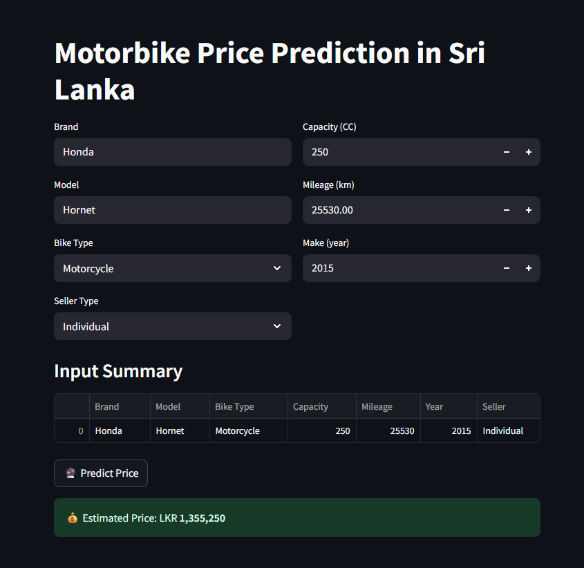

# Motorbike Price Prediction in Sri Lanka

A machine learning application that predicts the **market price of used motorbikes** in Sri Lanka based on specifications such as brand, model, engine capacity, mileage, and year.  
This project includes:
- A **trained ML pipeline** using `RandomForestRegressor` and `XGBoost`
- **Data preprocessing** with `ColumnTransformer` and `Pipeline`
- **MLOps tracking** using `MLflow`
- A **Streamlit web interface** for real-time predictions

---

## Project Overview

Motorbike prices in Sri Lanka vary based on several features like brand, mileage, and engine capacity.  
This project automates the prediction process using machine learning and provides an easy-to-use web interface for users.

---

## Project Structure

```bash
Motor-Bike-Price-Predictor/
│
├── notebooks/
│ ├── motor_bike_price_predictor.ipynb
│ ├── data_cleaning.ipynb
│ └── mlruns/
│
├── models/
│ ├── final_rf_pipeline.joblib
│ └── final_xgb_pipeline.joblib
│
├── app/
│ └── app.py 
│
├── data/
│ └── motorbike_data.csv
│
├── requirements.txt
├── README.md
└── .gitignore
```


---

## Features

**Data Preprocessing** — Handles categorical and numerical features using `ColumnTransformer`  
**Model Training** — Compares RandomForest and XGBoost regressors  
**Pipeline Serialization** — Saves models with `joblib` for deployment  
**MLflow Integration** — Tracks experiments, hyperparameters, metrics, and model versions  
**Streamlit UI** — Allows users to input motorbike details and get instant predictions  
**Local MLflow Server** — Enables experiment tracking through an interactive dashboard  

---

## Machine Learning Workflow

1. **Data Cleaning**
   - Converted columns like “Mileage: 35,000 km” → `35000`
   - Converted “Capacity: 150 cc” → `150`
   - Converted “Price: 440,000” → `440000`

2. **Feature Engineering**
   - Categorical encoding using `OneHotEncoder`
   - Numerical scaling using `StandardScaler`

3. **Model Training**
   - Trained both `RandomForestRegressor` and `XGBoostRegressor`
   - Tuned hyperparameters
   - Evaluated with `R²` and `Mean Absolute Error (MAE)`

4. **MLOps with MLflow**
   - Tracked runs, parameters, and metrics using MLflow
   - Stored model artifacts for version control

5. **Deployment**
   - Built Streamlit app for user interaction
   - Integrated MLflow logging in the app to track predictions

---

## Streamlit Application

### Run the App
```bash
cd app
streamlit run app.py

```
Then open: http://localhost:8501



## MLflow Experiment Tracking
Start the MLflow UI
```bash
mlflow ui --backend-store-uri mlruns
```
Then open: http://localhost:5000


## Installation
Clone the Repository
```bash
git clone https://github.com/iRajapaksha/Motor-Bike-Price-Predictor.git
cd Motor-Bike-Price-Predictor
```

Create Virtual Environment
```bash
python -m venv venv
venv\Scripts\activate  # on Windows
source venv/bin/activate  # on Mac/Linux
```
Install Dependencies
```bash
pip install -r requirements.txt
```
Verify MLflow and Streamlit
```bash
mlflow --version
streamlit --version
```

## Future Improvements

- Integrate a SQL database for prediction logs

- Use Docker to containerize MLflow and Streamlit

- Deploy app on AWS or Render

- Automate retraining pipeline using CI/CD

- Add feature importance visualization in the UI

## Author

- Ishara Rajapaksha
- Kavinda Aludeniya

Final-year Computer Engineering Undergraduate, University of Ruhuna
